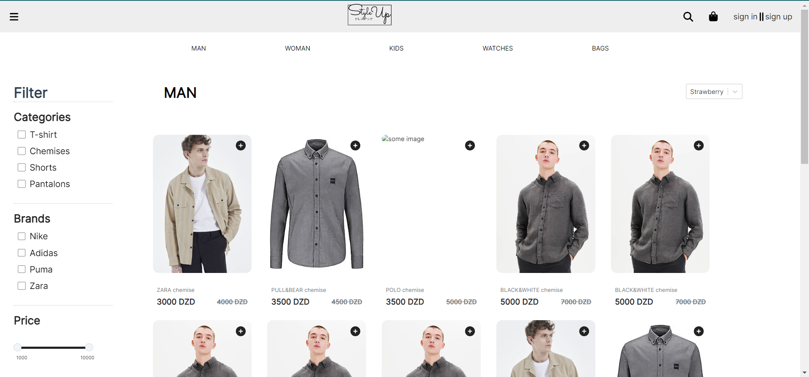

<div align="center">
<h1 align="center">

<br>e-com-website</h1>
<h3>◦ HTTPStatus Exception: 401</h3>
<h3>◦ Developed with the software and tools below.</h3>

<p align="center">


</p>


</div>

---

## 📖 Table of Contents

- [📖 Table of Contents](#-table-of-contents)
- [📍 Overview](#-overview)
- [📦 Features](#-features)
- [📂 Repository Structure](#-repository-structure)
- [⚙️ Modules](#modules)
- [🚀 Getting Started](#-getting-started)
  - [🔧 Installation](#-installation)
  - [🤖 Running e-com-website](#-running-e-com-website)
  - [🧪 Tests](#-tests)
- [🛣 Roadmap](#-roadmap)
- [🤝 Contributing](#-contributing)
- [📄 License](#-license)
- [👏 Acknowledgments](#-acknowledgments)

---

## 📍 Overview

As a team of 4 (@BeeLTL, @Reikoii, @Maaaadox) we had the idea to implement a modulable e-commerce website for commercialising it, and at the same time learn more about design, frontend and backend. The project isn't done yet as it isn't even remotely usable.



---

## 📦 Features

- Filtering
- Front-end implementation

## TODOS

- Implement the remaining features
- Responsiveness
- Backend fonctionalities
-

---

## 📂 Repository Structure

```sh
└── e-com-website/
    ├── .gitignore
    ├── package-lock.json
    ├── package.json
    ├── public/
    │   ├── favicon.ico
    │   ├── index.html
    │   ├── logo192.png
    │   ├── logo512.png
    │   ├── manifest.json
    │   └── robots.txt
    ├── README.md
    └── src/
        ├── App.test.js
        ├── assets/
        ├── components/
        ├── css/
        ├── data/
        ├── index.js
        ├── logo.svg
        ├── models/
        ├── pages/
        ├── react-app-env.d.ts
        ├── reportWebVitals.js
        └── setupTests.js
```

## 🛣 Roadmap

> - [x] `ℹ️  Task 1: Implement X`
> - [ ] `ℹ️  Task 2: Implement Y`
> - [ ] `ℹ️ ...`

---

## 🤝 Contributing

Contributions are always welcome! Please follow these steps:

1. Fork the project repository. This creates a copy of the project on your account that you can modify without affecting the original project.
2. Clone the forked repository to your local machine using a Git client like Git or GitHub Desktop.
3. Create a new branch with a descriptive name (e.g., `new-feature-branch` or `bugfix-issue-123`).

```sh
git checkout -b new-feature-branch
```

4. Make changes to the project's codebase.
5. Commit your changes to your local branch with a clear commit message that explains the changes you've made.

```sh
git commit -m 'Implemented new feature.'
```

6. Push your changes to your forked repository on GitHub using the following command

```sh
git push origin new-feature-branch
```

7. Create a new pull request to the original project repository. In the pull request, describe the changes you've made and why they're necessary.
   The project maintainers will review your changes and provide feedback or merge them into the main branch.

---

## 📄 License

This project is licensed under the `ℹ️  LICENSE-TYPE` License. See the [LICENSE-Type](LICENSE) file for additional info.

---

## 👏 Acknowledgments

`- ℹ️ List any resources, contributors, inspiration, etc.`

[↑ Return](#Top)

---
